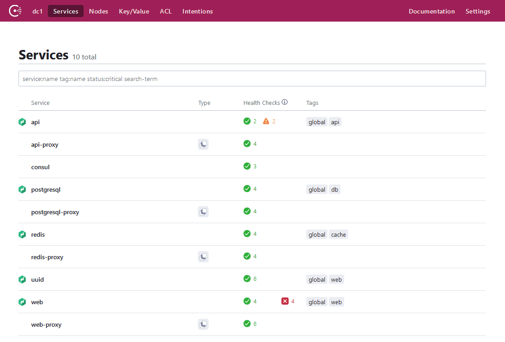

layout: true
class: compact,img-right
background-image: url(../../assets/images/backgrounds/HashiCorp-Content-bkg.png)
background-size: cover
name: slide05

# Consul Catalog

The catalog is an API that allows you to register services, and to define health checks governing whether a given service
should be discoverable

It is the source of truth for entities running in your deployment environment(s), and provides a real time view into:
- Datacenters
- Nodes
- **Services**

???

This is where Consul's service catalog comes in

The service catalog is an API that allows us to register services, and to also
define health checks that govern whether a service should be discoverable

It acts as the source of truth for services running in an environment, and will
provide the most up to date information about what is actually running in your environment(s)

You can query the API using its REST endpoints, or use the consul command line tool to extract
information, or modify information about services through service definitions

---

