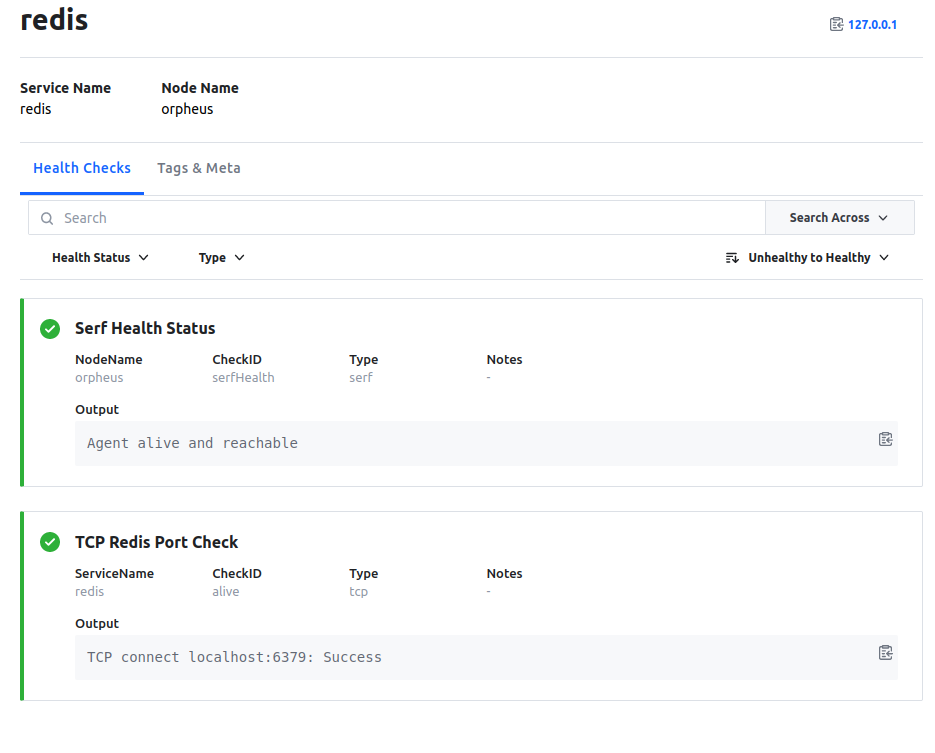

layout: true
class: compact, col-2
background-image: url(../../assets/images/backgrounds/HashiCorp-Content-bkg.png)
background-size: cover
name: slide06

# Registering a Service

**redis-service.hcl**
```hcl
1   service {
2     name = "redis"
3     id   = "redis"
4     port = 6379
5     tags = ["primary"]
6     check = {
7        id = "alive"
8        name = "TCP Redis Port Check"
9        tcp = "localhost:6379"
10       interval = "10s"
11       timeout = "2s"
12     }
13  }
```

```bash
$ consul services register redis-service.hcl
```


.center[]

???

Here's an example minimal configuration to define and register a service such as redis with consul

We define a configuration file called `redis-service.hcl`, we give it a name and an identifier, and the port
that it will be accepting traffic

Because this is a single instance of redis, we tag this service as the primary to denote that it will accept
write requests

Furthermore, we define a basic healthcheck that will make a TCP check on our defined port that we expect to be up

To officially register our new redis service, we can use the command line utility to use the `service register`
command with the service definition configuration file as the argument

When we go to the consul UI, we can now see our service defined in the catalog, as well as the TCP health
check that we provided

Other services can use consul to query the registry to discover this service, and if the health check starts
failing, consul will stop advertising to other services that the redis instance is healthy

---
